# Mod 4 Final Project - 
# Classifying Hate Speech Tweets

#### Author: Max Steele


**A warning and disclaimer:**
--
- **Due to the nature of this project, this notebook contains content that is racist, sexist, ableist, homophobic, transphobic, and offensive in numerous other ways.** <br>

- **At certain points throughout this project I use the word "queer", which I realize some people may find offensive. However, this is because I identify as queer. This word has worked its way into my regular vocabulary and I have found that this reclamation of a slur is the best way to succinctly describe my identity.** This is also an example of just how difficult it can be to classify hate speech without much context, but that is what I attempt to do with the models in this project.

<br><br>
The goal of this project was to build a classifier to correctly label tweets as either "Hate Speech", "Offensive Language", or "Neither". The main purpose of my modeling efforts was to make these classifications as accurately as possible. Essentially I want to be able to catch instances of hate speech as often as possible without flagging tweets that merely contain offensive language or nothing offensive too frequently. Such a model could be useful for helping social media platforms like Twitter enforce policies against hate speech and hateful conduct without unnecessarily limiting other forms of expression (even when that expression may be offensive, but isn't technically hate speech).

Twitter's full hateful conduct policy can be found <a href="https://zero731.github.io/model_selection_validation_and_tuning">here</a>. The company's goal is to allow for freedom of expression and the "representation of a diverse range of perspectives". Twitter acknowledges that hate speech and otherwise "hateful conduct" is often used on social media as a means to promote violence against, threaten, or otherwise harass and abuse people "on the basis race, ethnicity, national origin, caste, sexual orientation, gender, gender identity, religious affiliation, age, disability, or serious disease." So while hate speech technically represents a certain type of perspective or voice, it is often used online to silence and otherwise harm marginalized and historically underrepresented communities. Twitter specifically prohibits the following under its hateful conduct policy:
 - "Violent threats"
 - "Wishing, hoping or calling for serious harm on a person or group of people"
 - "References to mass murder, violent events, or specific means of violence where protected groups have been the primary targets or victims"
 - "Inciting fear about a protected category"
 - "Repeated and/or non-consensual slurs, epithets, racist and sexist tropes, or other content that degrades someone"
 
Aiming to correctly classify such tweets as hate speech, I used the dataset of tweets made available <a href="https://github.com/t-davidson/hate-speech-and-offensive-language">here</a> that was used as part of a research effort published in the following paper:
```
@inproceedings{hateoffensive,
  title = {Automated Hate Speech Detection and the Problem of Offensive Language},
  author = {Davidson, Thomas and Warmsley, Dana and Macy, Michael and Weber, Ingmar}, 
  booktitle = {Proceedings of the 11th International AAAI Conference on Web and Social Media},
  series = {ICWSM '17},
  year = {2017},
  location = {Montreal, Canada},
  pages = {512-515}
  }
```
This dataset contained tweets that had been labeled as belonging to one of the three categories based on votes (the class with the majority of votes for a specific tweet became its label) and were not classifications made by Twitter itself.<br>


## Data
The data used were obtained <a href="https://github.com/t-davidson/hate-speech-and-offensive-language">here</a> and are associated with the paper by Davidson et al. cited above. The dataset contains the following columns/ information: 
* **count** = number of CrowdFlower users who coded each tweet (min is 3, sometimes more users coded a tweet when judgments were determined to be unreliable by CF)
* **hate_speech** = number of CF users who judged the tweet to be hate speech
* **offensive_language** = number of CF users who judged the tweet to be offensive
* **neither** = number of CF users who judged the tweet to be neither offensive nor non-offensive
* **class** = class label for majority of CF users (0 - hate speech, 1 - offensive language, 2 - neither)

The original dataset consists of a total of 24,783 tweets.


## Methods
I followed the OSEMN data science process to approach this problem. Since there are no missing values in the dataset, the bulk of scrubbing and exploring dealt with how to process the text of each tweet prior to analysis. I found the classes of the original/full dataset, a total of 24,783 tweets, to be extremely imbalanced (77.4% offensive language, 16.8% neither, and 5.8% hate speech). 

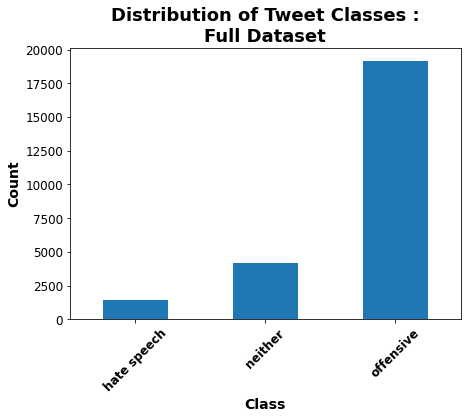

To address this, I chose to undersample the offensive language class. I randomly sampled a subset of 4,407 of the original 19,190 offensive tweets. Combined with all the hate speech and neither tweets, the dataset used for modeling and analysis consisted of 10,000 tweets. The offensive language and neither classes were nearly completely balanced, while hate speech still made up the minority class. 

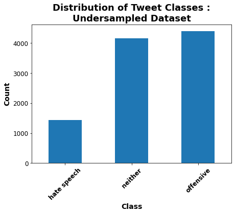

I did also attempt some initial modeling with a completely balanced dataset where both the offensive language and neither classes were undersampled to exactly match the number of hate speech tweets. However, these models were substantially less accurate than those built with the dataset of 10,000 tweets. This is not necessarily surprising since the completely balanced set consisted of only 4,290 tweets and natural language processing tends to work better with larger bodies of texts.


### Tweet Processing
To get the tweets ready for modeling, I cleaned them of urls, mentions, emojis, hashtags (only the symbols, not the text of the hastag), numerical symbols and other symbols. This was functionized, making use of regular expression, and done prior to vectorizing the text. 
Vectorization was done as part of pipelines which also fit the various classifiers that I tested for this task. I used Natural Language Toolkit's TweetTokenizer when vectorizing the text and set the tokenizer to reduce the length of repeated characters (so that things like "boyyyyyyyyy", "boyyyyy", and "boyyy" would all be treated as the same word: "boyyy") and to somewhat reduce dimensionality. Stop words and punctuation were also removed as part of the vectorizing process. For each type of classifier that I tested, I first tried using Scikit-Learn's CountVectorizer, then compared the same classifier using Scikit-Learn's TfidfVectorizer.
All classifiers were tested on non-lemmatized data. After tuning and selecting the top-performing model, a model with the same parameters was fit and evaluated using lemmatized versions of the same training and testing subsets.


### Modeling
Classifiers were fit using Scikit-Learn (for Random Forests, Multinomial Naive Bayes, and LinearSVC) or XGBoost (for XGB classifiers). All types of classifiers were first fit using default parameters, then tuned to optimize first accuracy, and then balanced accuracy using GridSearchCV to test a grid of hyperparameter values. All classifiers were trained and tested on the same training and test subsets randomly generated from the undersampled dataset of 10,000 tweets (8,000 for training and 2,000 for testing).

Model quality and performance were primarily assessed based on overall accuracy and the recall for the hate speech class.


## Results

### CountVectorizer vs. TfidfVectorizer
Across the various types of models that I tested, there was a consistent pattern that the model fit using the TfidfVectorizer might attain a marginally higher overall accuracy (usually about 1-2% higher). However, the same model fit using the CountVectorizer generally had better recall for the hate speech class. This was true for the baseline Random Forest and LinearSVC models, as well as the baseline Multinomial Naive Bayes classifier. The default MNB with the TfidfVectorizer actually performed the worst of all models tested, with the lowest overall accuracy of 78% and a recall for hate speech far worse than random guessing (confusion matrices for both default MNB classifiers shown below).

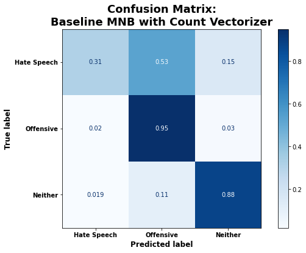
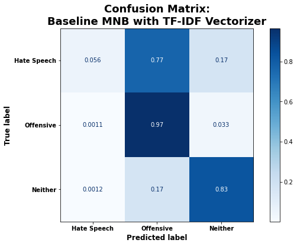

Even after hyperparameter tuning, the CountVectorizer tended to work best for maximizing recall on hate speech while barely impacting overall accuracy if at all.


### Comparison of Classifiers
When comparing the baseline classifiers built using the default parameters, I found that the LinearSVC models tended to perform the best, followed by the Random Forest classifiers, then XGradient Boost, with Multinomial Naive Bayes performing very noticeably the worst (especially for correctly identifying hate speech). These trends remained relatively consistent even after hyperparameter tuning via grid-searching. All classifiers were improved to some extent through hyperparameter tuning. 


### Interpretation of Best Classifier
The all around best model was the LinearSVC model using the Count Vectorizer and tuned to optimize balanced accuracy. This model had one of the highest overall accuracies (86%, while the maximum overall accuracy for any model was 87%) and by far the highest recall for correctly classifying hate speech as hate speech 63% of the time. The model retained one of the highest recalls for predicting the neither class correctly for 95% of test cases and did not sacrifice much in recall for offensive tweets, labeling that class correctly 86% of the time.

``` 
# .best_params_
{'count_vec__min_df': 2,
 'count_vec__ngram_range': (1, 3),
 'svc__C': 0.1,
 'svc__class_weight': 'balanced'}
```

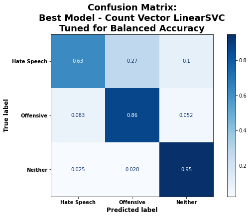
<br>
As shown in the figure below, the best model relied heavily on various queer and racial slurs to push it towards a classification of hate speech. The singular and plural version of many of these words show up in the top 10 positive predictors of the hate speech class. Thus, I also trained the same model on a lemmatized version of the same training data to see if this improved model performance (it did, but barely) and to examine what additional words appear as top predictors when singular and plural versions of slurs are treated as the same word.
Words that were most negatively associated with hate speech (in that their presence in a tweet pushed the model towards either offensive language or neither) mostly seem fairly random and benign ("big", "tonight", "hunter", and "charlie". "Female" may show up because if someone is using that word then they are probably using it instead of words like "bitch(es)" and "ho/e(s)" which were major positive predictors of offensive language tweets. 

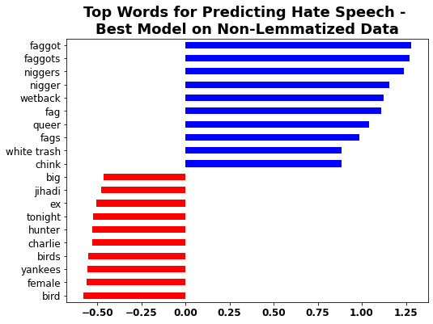
<br>
Shown below, words that most strongly push the model towards a classification of "offensive language" fall into two general categories: terms that are offensive and derogative of women and femininity ("bitch(es)", ("hoe(s)", "pussy/ies", and "twat") and modified versions of the n-word ("niggah", "niccas", "nigguh"). These words are relatively uncommon in hate speech, but are deemed offensive by many people. 
As seen for predicting hate speech, the model relies most heavily on positive predictors rather than negative predictors. Some top negative predictors of offensive language are terms that would be more indicative of hate speech (but that interestingly did not make the top list for hate speech) such as "spic" and "dyke bitches". 

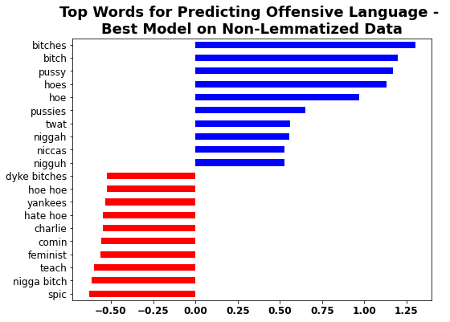
<br>
As shown below, predictions of the "neither" class are most influenced by negative coefficients rather than positive coefficients. Basically the inclusion of the terms represented by red bars strongly push the model to predict a different class (either hate speech or offensive language). The inclusion of any particular word does not strongly indicate that the tweet belongs to the neither class, so essentially the model is ruling out those two classes before predicting neither. This would explain why the top positive coefficients are fairly small and the words themselves seem relatively random. The top positive predictors of the neither class would likely vary quite a bit depending on the sample of training data. However, the top negative predictors of the neither class are unlikely to vary much as those are generally extremely indicative of hate speech and/or offensive language. In fact, the list of top negative predictors consists entirely of curse words, slurs, and slang terms that some people consider offensive.

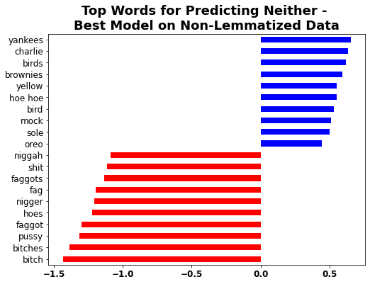


<br>
### Best Model Trained and Tested on Lemmatized Data
Since many of the top predictors of hate speech and offensive language were the singular and plural versions of slurs, I fit and evaluated a model on the same train-test split used for all other models, but with a lemmatized version of the text. The lemmatized version of the best model performed marginally better with the same overall accuracy of the original model (86%) and 65% recall of hate speech (a slight improvement over the original 63%) with a slight decrease in recall for the neither class (from 95% to 94%). Since this model performs slightly better for the class of interest without unnecessarily flagging many more inoffensive ("neither") tweets as hate speech (an increase from 2.5% to 2.8% of neither tweets misclassified as hate speech), I consider this the best modeling approach and focus the rest of the interpretation and the recommendations on this particular model.

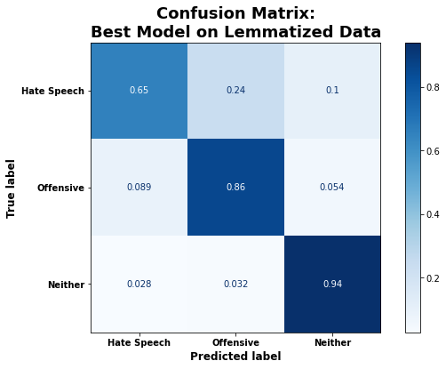
<br>
As shown below and previously seen for the same model trained on non-lemmatized data, this model relies heavily on various queer and racial slurs to push it towards a classification of hate speech. The original singular predictors show up in addition to "jew", "feminist", and "dyke". Words that were most negatively associated with hate speech (in that their presence in a tweet pushed the model towards either offensive language or neither) stayed mostly the same. 

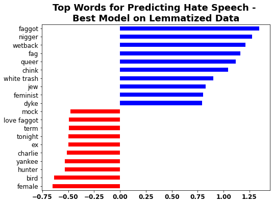
<br>
As before, words that most strongly push the model towards a classification of "offensive language" fall into two general categories: terms that are offensive and derogative of women and femininity and modified versions of the n-word. These words are much less common in hate speech, but are deemed offensive by many people. The words "bitch", "pussy", and "hoe" are the main predictors of offensive language.

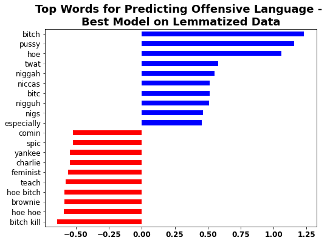
<br>
As seen before, predictions of the "neither" class are most influenced by negative coefficients rather than positive coefficients. The inclusion of any particular word does not strongly indicate that the tweet belongs to the neither class, so essentially the model is ruling out the other two classes before predicting neither. This would explain why the top positive coefficients are fairly small and the words themselves seem relatively random. Once again, the top negative predictors of the neither class are curse words, slurs, and slang terms that some people consider offensive.

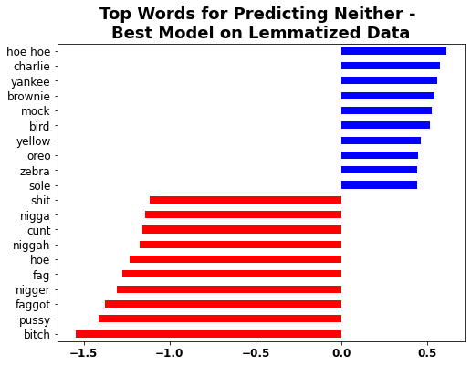


<br>
### Analyzing Hate Speech Misclassifications - False Negatives
The model experienced a similar pattern of difficulty classifying hate speech tweets as the people who voted on the true label of each tweet. All hate speech tweets were classified as such based on majority vote, but sometimes the vote was mixed. 

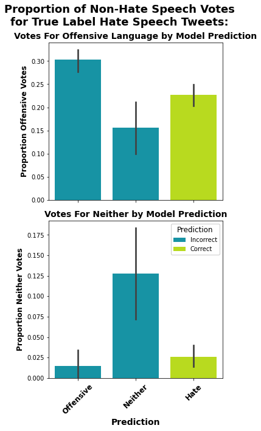

For hate speech tweets that received one or more votes for merely offensive language, the model was also likely to misclassify as offensive langauge. And for hate speech tweets that received one or more votes for neither, the model was also likely to misclassify as neither. 

<br>
Of the 78 hate speech tweets incorrectly labeled as merely 'offensive language' by the model, several of them do not clearly appear to be hate speech at least to me. 
 - For example, the following tweet certainly contains language most would classify as offensive. However, in this context, it appears to possibly be an overall positive tweet and may be an example of a minority group reclaiming a slur for their own use. <br> **Wish I coulda said more to @EmmaleeeParkerr tonight. Good seeing you fag. &#128540;** <br>
 - In another example, the following tweet is certainly offensive and uses what is now most often considered a slur for referring to those with intellectual disabilities. However, it is not targeting any specific person or inciting violence or harm against a marginalized group. One could possibly make the argument that it promotes harmful stereotypes, but it is difficult to tell. As such, it is not clear cut that this violates Twitter's hateful conduct policy. <br> **DeeDee, Patrick, Ed, Sheen, Timmy's Dad, Beavis &amp; Butthead, Peter Griffin. This is just a list of SOME mentally retarded cartoon characters.** 
 - Certain versions of the n-word such as "nigga", "nicca", "niggah", and "nigguh" are frequently used by black people in a way that reclaims the original slur. While many people still regard these versions as offensive, especially when appropriated by other racial groups, these words are not strongly associated with clear cut hate speech like the original slur. So depending on context and who is using the word, these words are less likely to indicate hate speech. The following tweets are some examples that voters classified as hate speech but that the model labeled as 'offensive':
   - **' Happppppy Birthdayyyy &#1041191;&#1041196;&#1043215; lol . Niggahs is really 21 in this bitch &#1043358;&#1041219; . http://t.co/YatU7pbsHX**
   - **RT @xDSmooth: The way this niggah just flinched at this movie was #priceless @1BookieG**
 - Similar to the above, the word "hoe" shows up several times in a way that I'm not sure can clearly be considered hate speech, and not just offensive language. Again, depending on who is using the word and the context, the following may or may not be considered hate speech against women:
   - **Lmao let these hoes be hoes ain't no Savin nem**
   - **Fucking with these hoes nigga don't be no dumby**<br><br>
   
One area where the model was weak in correctly classifying hate speech and misclassifying it as merely offensive language were instances of direct threats, wishing someone harm, or the use of slurs to degrade specific inidividuals such as the following:
 - **@IWantHis_Heart Ok u fat precious lookin ass bitch, u big fat back at the barnyard lookin ass bitch. I can fix my grammar but u still fat**
 - **@kieffer_jason here let me say it more clearly since your retarded ass don't understand**
 - **Lol you're a cunt liar and I hope you drop dead k :-)**
 - **@QUAN1T0 You retarded bruh lol**
 - **@sho_time_ @MitchVorce chill ur pussy gay af**
 - **RT @__bettyboo: You better pray I don't send your nudes out bitch**
 - **it means that im following orders and being subordinate. sue me, ya dyke** <br>

This issue might be partially addressed by incorporating whether or not a tweet tags someone when such derogatory and/or threatening language is used. However this would not catch cases where no specific individual is tagged or when these statements are made about protected categories.

Below is a wordcloud depicting the most common words for true labeled hate speech tweets which the model mislabeled as merely containing offensive language. Many of the most prominently featured words are top predictors positively associated with the offensive language class:

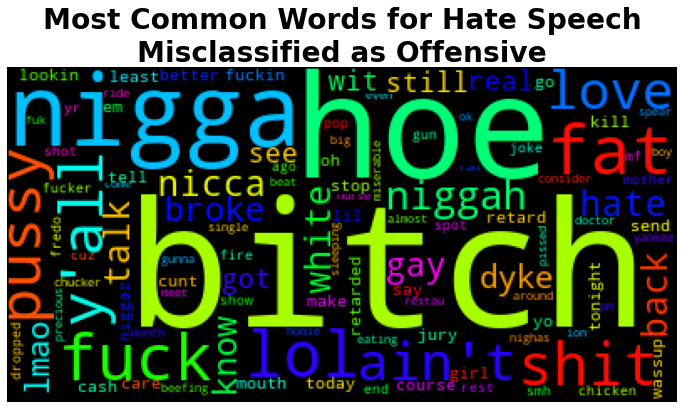


<br><br>
Of the 29 hate speech tweets incorrectly labeled as neither hate speech nor 'offensive language' by the model, a few do not seem to be clear cut as hate speech. 
 - For example, the following tweet is someone referring to herself and it's not particularly hateful. Voters that classified this tweet as hate speech may have objected to the use of the word "hillbilly", but she's applying the word to herself and there is no ill intent. <br> **looking like a hillbilly and not matching is what I do best goodnight losers http://t.co/caGHBLKAXQ** <br>
 - In another example, the following tweet is not hate speech if "Yankees" is referring to a team. Team rivalries exist and there is no threat or actual ill intent to the team in this tweet. Simply saying that you hate something does not constitute hate speech or hateful conduct as defined by Twitter. <br> **@erinscafe We hate the Yankees though, right? I feel like I'm really good at hating them.** 
 - As seen previously, certain versions of the n-word such as "nigga", "nicca", "niggah", and "nigguh" are frequently used by black people in a way that reclaims the original slur. While many people still regard these versions as offensive, especially when appropriated by other racial groups, these words are not strongly associated with clear cut hate speech like the original slur. So depending on context and who is using the word, these words are less likely to indicate hate speech. The following tweets are some examples that voters classified as hate speech but that the model labeled as 'neither':
   - **Told my dad to go buy cookies for the graduation reception...this nigga bought Oreos.**
   - **I already know you trash if being tatted is on the list of things you want in a nigga..**<br><br>
   
Again, one area where the model was weak in correctly classifying hate speech and misclassifying it as neither hate speech nor offensive language were instances of direct threats, wishing someone harm, or the use of slurs to degrade specific inidividuals such as the following:
 - **@BraxCity29 @maria_obregon_g @sophia_freeman1 3/4 of a citizen. I said it for you maria you spic**
 - **"@NotoriousBM95: @_WhitePonyJr_ Ariza is a snake and a coward" but at least he isn't a cripple like your hero Roach lmaoo**
 - **Of course my #faith for #baseball is off this year. BECAUSE OF #BARRYBONDS you goddamn retards!!!!!!!!!!!!!!!!!!!!!!!!!!!!!!!!!!! #morons**
 - **@Flow935 jus wanted to let y&#225;ll know hope the hurricane kills your soca sunday trash #LORDWILLIN** <br>

This issue might be partially addressed by incorporating whether or not a tweet tags someone when such derogatory and/or threatening language is used. However this would not catch cases where no specific individual is tagged or when these statements are made about protected categories.

The model also had issues picking up on less commonly used slurs such as "coon", "spic", "spook", "colored people/folks", "muzzies", "raghead", "monkey", and modified versions of the n-word such as "niggerous" and "niggress". It also did not pick up very well on slang commonly used to refer to white people such as "redneck" and "bird". Below is a wordcloud depicting the most common words for true labeled hate speech tweets which the model mislabeled as neither hate speech nor offensive:

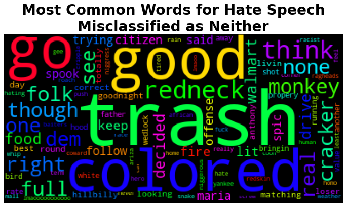
<br><br>
 

### Analyzing Hate Speech Misclassifications - False Positives
For both offensive language and neither tweets that received one or more votes for hate speech, the model was also more likely to misclassify as those as hate speech ("false positive").

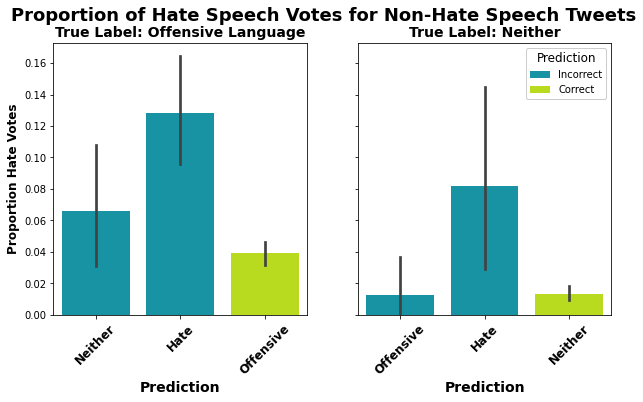

<br>
Of the 78 offensive language tweets incorrectly labeled as hate speech by the model, a few seem like they may meet Twitter's definition of prohibited hateful conduct even though the majority of votes did not classify them as such. 
 - For example, the following tweet seems like it is targeting a specific individual and is using a slur associated with a disability to degrade someone. This would directly violate Twitter's hateful conduct policy. <br> **@TakingBackSunda @NYCGreenfield @lsarsour that's not how you resist, you worthless retard. Do you need a dictionary?** <br>
 - In another example, the following tweets seem similar to the above in that they target or mention a specific person and aim at degrading them using a slur referring to sexual orientation. Two of them are even specifically aimed at stopping the mentioned individuals from expressing themselves.
   - **@shoe1945 @NotoriousBM95 @333England shut ur faggot ass up you thirsty pussy** 
   - **This nigga Magic Johnson got a Grade A faggot for a son &#128514;&#128514;.. He had to have done some terrible shit growin up lol..**
   - **@Roscoedash shut the fuck up, your wack as fuck. Garbage mohawk having faggot, stop making music and shovel my snow scrub.**<br><br>
   
In some instances, the model seems to be misclassifying offensive language tweets as hate speech based on versions of the n-word such as "nigga", "nicca", "niggah", and "nigguh" when the context of the tweet does not seem to meet the specifications of hateful conduct. Additionally, some of these tweets seem very similar to tweets that the voters labeled as hate speech, but that the model classified as merely offensive. Depending on context and who is using the word, these words are less likely to indicate hate speech, but voters seemed to have treated these words inconsistently. The following tweets are some examples that voters classified as offensive, but that the model labeled as hate speech:
  - **I'm coming for that no 1 spot nigguh @Nichollsodeon**
  - **&#8220;@FunnyPicsDepot: When the nigga with the aux cord playin some trash shit http://t.co/LMP5BeplVy&#8221; @JWilko7**
  - **@KazAtta LOL this is why u my nig**<br><br>
   
The model also misclassifies offensive tweets as hate speech based on the presence of slurs commonly used in hate speech tweets, but in the context are not being used as such. 
 - For example, some tweets seem to be reclaiming certain slurs and/or using them as terms of endearment in a way that could be considered offensive, but doesn't constitute hate speech:
   - **@jacksparenohoe let's hang out nigger**
   - **@laser_beam26 text me fag**
   - **@jaaaaaade__ Shut up. And miss you too fag**
 - In other examples, the use of the slurs seems to be part of a retelling of an occurrence or conversation that involved hate speech, but is not hate speech itself:
   - **Nile... RT @JosephBananas I'm really sad that I don't have enough friends to ever be called "a pack of niggers" with. That's my fuckin dream**
   - **some guy said I was wearing leggings and laughed and called me a fag. they're JEGGINGS, asshole.**

Additionally, it seems like the model may be picking up on the word "trash" and using that to misclassify tweets as hate speech, potentially when used in the same tweet with other specific words:
 - **Who the hell is gonna buy your shit when your dirty panties and trash are clearly in the background of the picture**

Below is a wordcloud depicting the most common words for true labeled offensive language tweets which the model mislabeled as hate speech:
 
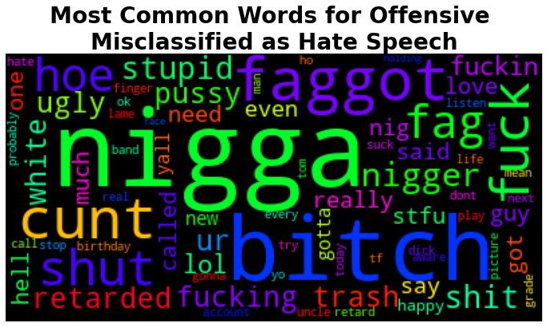

<br>

Of the 23 neither tweets incorrectly labeled as hate speech by the model, several seem like they should have at least been labeled as offensive based on the use of slurs. For example:
 - **You all are retarded if you really Kendrick was trying to diss all those rappers, don't think just cuz names were said he was coming at them**
 - **Looks like a tool but is useful as a clay hammer #fag @hOPPondis http://t.co/K7wqlAWRwM**
 - **I I haven't watched a single episode of #LHHNY however I'm watching the reunion. This coon shit. I mean the levels of ratcheticity** 
 - **Being coons &#8220;@FatTravis_6200: At??? @TiFFANY_P0RSCHE: Y'all are amazing."&#8221;**<br>
 
Others seem like they could very likely be hate speech depending on context.
 - For example, the following tweet uses a slur to degrade two specific people:
   - **8: The two ringless fags RT @EverybodyHatesX: Barkley &amp; Reggie were talking nonsense the entire game**
 - This one tells someone to log off (presumably an attempt to stop them from expressing themselves online) and uses a racial slur to degrade them:
   - **Log off nigger RT @PoloKingBC: #relationshipgoals http://t.co/Ge9koImYGj**<br><br>   

Somewhat interestingly, the model is picking up on tweets that could absolutely be considered racist, but that may not technically meet Twitter's definition of hateful conduct. For example:
 - **Aren't these little border jumpers supposed to be in school**
 - **RT @Black__Elvis: My favorite episode of Friends is the one where blacks mysteriously vanish and unemployed white people find affordable ho&#8230;**


And, as seen previously, the model appears to be picking up on the word "trash" when in the presence of other specific words when the context does not clearly indicate that the text is hate speech. For example:
 - **The Saints are pure trash lol smh**
 - **Photo: Giving you that trailer park trash. #transformthursday #ladykimora #vegasqueens #vegasshowgirls http://t.co/LjejFufULK**
 - **@Blackman38Tide bandana Orian. They called me trailer trash for wearing my lil country getup &#128545;**

Below is a wordcloud depicting the most common words for true labeled neither tweets which the model mislabeled as hate speech:

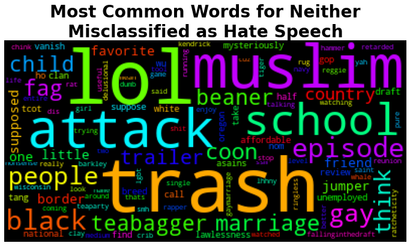

<br>

## Conclusions and Recommendations
Overall the best model was extremely accurate when it came to classifying tweets that were neither hate speech nor offensive language. It correctly labeled 94% of the neither tweets from the test data and only flagged 2.8% of that category as hate speech. The model relied heavily on words like "bitch", "pussy", "faggot", "nigger", "fag", "hoe", "nigga(h)", "cunt", and "shit" to make this classification. If any of those words (which are all considered offensive to some degree and many of which are commonly used in hate speech) were present in a tweet, the model was extremely unlikely to classify it as neither. 

The best model was also very successful at detecting tweets containing offensive language but not hate speech, correctly labeling 86% of those tweets in the test data. It did so by relying very heavily on the presence of the words "bitch", "pussy", and "hoe". However it did flag 8.9% of merely offensive tweets as hate speech.

Hate speech proved trickier to classify, but the model still performed much better than randomly choosing among the three categories (33% chance of an accurate random guess) because it classified 65% of the hate speech tweets correctly. Slurs like "faggot", "nigger", "wetback", "fag", "queer", and "chink" were among the top predictors indicating that a tweet contained hate speech. Hate speech was most commonly misclassified as offensive language (24% of hate speech tweets in the test data).<br>
- --
Investigations into false negatives and false positives when classifying hate speech brought several key things to light. One was that the model has similar difficulties in classifying hate speech as the people who voted on which class the tweets belonged to. When votes were more mixed, the model was often likely to predict the class that had received some portion of the votes, though not the majority. Hate speech can sometimes be blaringly obvious, other times its interpretation is dependent on context and/or a knowledge of less commonly known slurs. Some of the model's false positive classifications of hate speech really did seem like they fit Twitter's criteria for hateful conduct. And for some of the false negative classifications of hate speech I am really unsure how or why anyone classified them as hate speech in the first place. Being able to trust the ground truth labels when training any model is of utmost importance, but this becomes difficult when there is grey area and labels are somewhat a matter of opinion and up for interpretation. 

Similar to the people that voted on the ground truth classifications for each tweet, the model had some difficulty when context was very important for determining whether or not something was hate speech. This resulted in both false positives and false negatives. In cases of false positives, sometimes an individual used a slur that often shows up in hate speech, but the context of the tweet clearly did not violate Twitter's hateful conduct policy because it did not target anyone specifically or promote violence or fear or harmful stereotypes. These were the type of tweets where if your friend said something along those lines you would respectfully let them know that was actually rather offensive, explain why, maybe have a discussion about it, and then move on (under the best of circumstances). This is absolutely not the job of any social media platform. Thus, any tweets flagged as hate speech need to be investigated. Tweets that are offensive and similar to hate speech, but don't meet the specifications laid out in the hateful conduct policy should be cleared without consequences imposed by Twitter. 

Another important type of false positive was text containing an account of someone being the target of or witnessing hate speech. Simply recounting such events does not violate Twitter's hateful conduct policy. Further, the experiences of marginalized commmunities with hate speech, harassment, and even violence are important for members of these communities to be able to share and spread awareness of. Social media platforms such as Twitter are an important place for these voices to be heard. Additionally, members of historically marginalized communities should be able to freely reclaim slurs for their own purposes (for example, the various versions of the n-word, or the way I use "queer" to describe my own identity). This should not be treated as hate speech, but the model sometimes flagged it as such and human observers also have difficulty disentangling this complexity.

More complex models such as neural networks may be better able to pick up on context when classifying hate speech. This would be a useful direction for future work. Even so, these models may still have trouble detecting certain very specific contexts of hate speech. For example, Twitter's hateful conduct policy specifically prohibits the "targeted misgendering or deadnaming of transgender individuals." Unless this is also accompanied by slurs and/or threatening or degrading speech within the same tweet, this seems like something nearly impossible for a model of any sort to pick up on. I'm not certain there were even any examples of this in the dataset because it is such a difficult thing to detect without more context or investigation. 

A related issue occurred when it came to detecting hate speech based on less commonly used slurs or hate directed towards a broad group of marginalized communities such as in the following tweet which the model classified as neither hate speech nor offensive langauge: **If some one isn't an Anglo-Saxon Protestant, they have no right to be alive in the US. None at all, they are foreign filth.** Thus, the human component of actively investigating and also relying on users to report abuse and hate speech will continue to be an important aspect of Twitter's efforts to uphold and enforce its hateful conduct policy.
- ---
Based on the insights from and results and performance of the top model, I have the following recommendations:
- This model (or any other algorithm) should only be used as a tool to help flag potential hate speech tweets that should then be investigated by Twitter. To allow for freedom of expression, it should generally not be used to trigger anything automatic, except perhaps in the following cases:
   - If there is an substantial uptick in the proportion of hate speech tweets being detected across the platform, this might usefully trigger ads or messages reminding users of the hateful conduct policy, what constitutes hate speech, how to report it, and what the consequences are for violating the policy.
   - If a substantial portion of an account's recent tweets have been flagged as potential hate speech, that account might be temporarily put into read-only mode and moved to top priority for the company to investigate as soon as possible. This would be especially important in cases where many of these potential hate speech tweets mention a specific user or users because this may indicate targeting/harassment.

- Maintain a database of tweets that were investigated for potentially violating the hateful conduct policy. As part of this database, keep a record of the parties involved, the final decision, the reason (i.e., for hate speech, which section(s) of the policy the tweet violated; for non-violating tweets, define categories for why it did not meet the criteria), and the consequence for the violation. This will be helpful not only for streamlining the process and dealing with similar violations consistently, but also for continuing to tune the model and hopefully build more complex models that are better able to pick up on the importance of context. This will also make the algorithm more specifically tailored to Twitter's own policy for categorizing hate speech than the current model which uses classifications made by people not associated with the company.
  - This will be especially important for the company to actively ensure that members of protected groups and marginalized communities are protected, rather than targeted by the algorithm. For example, versions of the word "nigga/niggah/nigguh/nicca" are very rarely used in true examples of hate speech. The current model could be improved with additional observations with these words correctly labeled as not violating the hateful conduct policy. Otherwise the algorithm may have a tendency to incorrectly flag tweets posted by black people as hate speech more often. Patterns such as these need to be actively sought out and counteracted.

- As language evolves and new slurs are invented and old ones experience resurgences, these words will need to be accounted for and flagged in some way before there is enough data for the model to learn and reliably pick up on them. 


## Future Work
* Since the models were all built using tweets posted prior to 2018, a logical next step would be to continue training the model with more recent tweets. This would help make the model more relevant.
* Adding additional tweets to the dataset, especially more examples of hate speech, would likely improve model performance. As more examples of hate speech are included, it is likely that the model would learn to pick up on more of the less commonly used slurs used in hate speech.
* Testing whether model performance improves by engineering features from the text itself such as whether or not someone was mentioned or if hashtags were used.
* Determine whether deep learning can improve accuracy by using neural networks for classification. It may be helpful to train word embeddings on a large set of tweets, tuning for various window sizes to try to capture the context that so often helps human observers recognize hate speech.